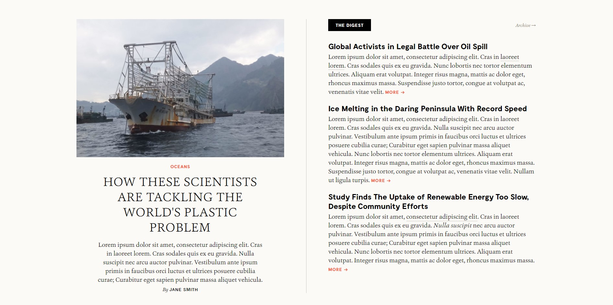

# COMP6080 Tutorial 1

## 1. Introductions (5min)
1. Name + Degree/Year + Hobby
2. [Course outline recap](https://cgi.cse.unsw.edu.au/~cs6080/26T3/course-outline)
> There will be 4 quizzes throughout the term. Held **in person** in your tutorials.

> Assignment 1 is out and is due on Monday the 28th September @ 8pm (week 3)
3. Using AI
4. [LingsCars](https://www.webdesignmuseum.org/gallery/lingscars-in-2014)

## 2. HTML + CSS basics (30min)
1. Install the Live Preview Extension

2. [List of HTML tags](https://www.w3schools.com/tags/default.asp)
> Headers, paragraphs, line breaks, text formatting, lists, images, links
3. CSS
> Inline CSS, stylesheets/type selectors, text styling, background styling, gradients, classes

4. Spans

5. Divs

6. Box Model
> Margins, borders, padding

7. Making a box
> In `box.html` can you make a box that is:
> * `100px` wide
> * `50px` high
> * `3px` of padding
> * `1px` border that is solid and of colour `#333333`
> * `5px` of margin on the left and right, and `10px` of margin on the top and bottom?
> * background colour of `rgb(255,255,0)`

## 3. Replicating an image (30min)

Build a page that looks identical to `page.jpg`. The window width you should work with is 1892 x 943 pixels. You are only allowed to use HTML and CSS for this task.

Please build your page in `index.html`. You are welcome to create as many CSS files that you need.

### Assets

* Your fonts do not need to match exactly. You may use font-family `Garamond` or `serif` for all serif text, and font-family `Arial` or `sans-serif` for all non-serif text (i.e. the titles of the articles on the right).

### Analysing the pages

Two things will want to seek external help for are (that you can't determine just by "looking" at it):
1) Determining the particular colour (RGB or HEX) of various pixels
2) Determining the size of particular elements (we recommend the use of [photopea](https://www.photopea.com/)).

## 4. CSS Games
[CSS Diner](https://flukeout.github.io)

[Flexbox Froggy](https://flexboxfroggy.com)